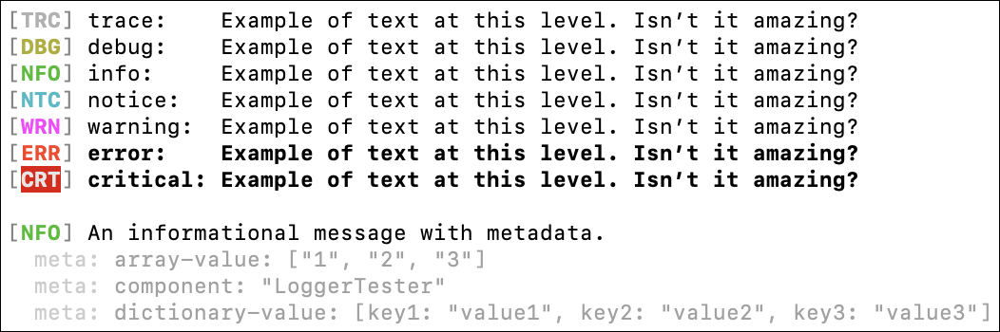
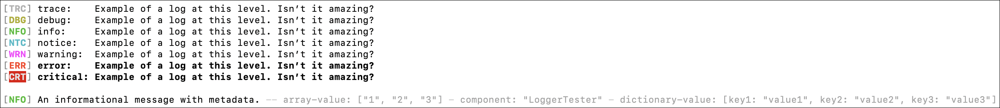
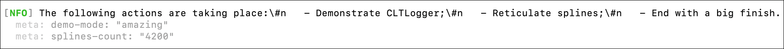
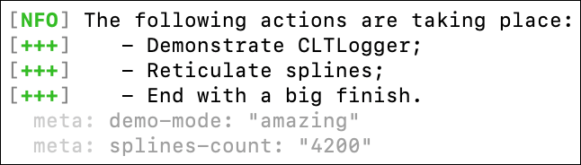
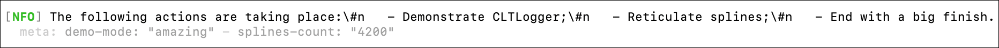
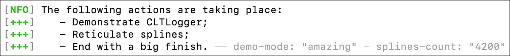

# ⚙️ CLTLogger (**C**ommand-**L**ine **T**ools Logger)

<picture></picture>
<picture></picture>
[](<https://github.com/xcode-actions/clt-logger/releases>)

A simple [swift-log](<https://github.com/apple/swift-log>)-compatible logger designed for Command Line Tools.

## Usage 🤓

Bootstrap the LoggingSystem with `CLTLogger` before creating any logger:
```swift
LoggingSystem.bootstrap(CLTLogger.init, metadataProvider: nil/* or whatever you want */)
```

## Screenshots 📺

_Note: The screenshots match the system theme (Dark vs. Light mode)._

### In a Terminal

<picture>
	<source srcset="./Docs/Screens/cltlogger-terminal-metadata-new-lines-dark.png"  width="526" media="(prefers-color-scheme: dark)">
	<source srcset="./Docs/Screens/cltlogger-terminal-metadata-new-lines-light.png" width="526" media="(prefers-color-scheme: light)">
	
</picture>

### In a Terminal, With Log and Metadata On the Same Line

<picture>
	<source srcset="./Docs/Screens/cltlogger-terminal-metadata-same-lines-dark.png"  width="1226" media="(prefers-color-scheme: dark)">
	<source srcset="./Docs/Screens/cltlogger-terminal-metadata-same-lines-light.png" width="1226" media="(prefers-color-scheme: light)">
	
</picture>

### In Xcode

<picture>
	<source srcset="./Docs/Screens/cltlogger-xcode-dark.png"  width="479" media="(prefers-color-scheme: dark)">
	<source srcset="./Docs/Screens/cltlogger-xcode-light.png" width="479" media="(prefers-color-scheme: light)">
	
</picture>

## Common Bootstrap Customization 🧰

By design `CLTLogger` does not print the label of the logger in its output, nor does it print the date.
If you need those information printed you can add them in the metadata of the logger using a convenience init of CLTLogger:
```swift
LoggingSystem.bootstrap(CLTLogger.initWithLabelAndDateMetadata, metadataProvider: nil/* or whatever you want */)
```
The label and date metadata are named respectively `zz-label` and `zz-date`.

## Advanced Configuration 🛠️

Almost everything is configurable in `CLTLogger`.

### Output Destination

The default output destination is `stderr` but can be changed to any file descriptor using `FileHandle`.

The rationale for logging to `stderr` is logs are not “normal” program output and should be ignored when piped to another program.

Let’s say for instance I’m coding a `sed` program in Swift.
When debugging I’m gonna want to log things in order to understand where my bugs are, but I do not want the output of my `sed` to be interlaced with logs!
So we log to `stderr`.

### Multi-Line Mode

Let’s say we’re running this:
```swift
Logger(label: "main").info(
   """
   The following actions are taking place:
      - Demonstrate CLTLogger;
      - Reticulate splines;
      - End with a big finish.
   """,
   metadata: [
      "demo-mode": "amazing",
      "splines-count": "4200",
   ])
```

Here are the possible output with the color logging style.

#### Multi-Lines Disallowed But Metadata On New Lines
_This is the default mode._
<picture>
	<source srcset="./Docs/Screens/cltlogger-multiline-disallow-but-metadata-on-new-lines-dark.png"  width="932" media="(prefers-color-scheme: dark)">
	<source srcset="./Docs/Screens/cltlogger-multiline-disallow-but-metadata-on-new-lines-light.png" width="932" media="(prefers-color-scheme: light)">
	
</picture>

#### Multi-Lines Allowed
<picture>
	<source srcset="./Docs/Screens/cltlogger-multiline-allow-dark.png"  width="323" media="(prefers-color-scheme: dark)">
	<source srcset="./Docs/Screens/cltlogger-multiline-allow-light.png" width="323" media="(prefers-color-scheme: light)">
	
</picture>

#### Multi-Lines Disallowed But Metadata On One New Line
<picture>
	<source srcset="./Docs/Screens/cltlogger-multiline-disallow-but-metadata-on-one-new-line-dark.png"  width="932" media="(prefers-color-scheme: dark)">
	<source srcset="./Docs/Screens/cltlogger-multiline-disallow-but-metadata-on-one-new-line-light.png" width="932" media="(prefers-color-scheme: light)">
	
</picture>

#### Multi-Lines Disallowed Fully
<picture>
	<source srcset="./Docs/Screens/cltlogger-multiline-disallow-dark.png"  width="1269" media="(prefers-color-scheme: dark)">
	<source srcset="./Docs/Screens/cltlogger-multiline-disallow-light.png" width="1269" media="(prefers-color-scheme: light)">
	
</picture>

#### Multi-Lines Allowed With Metadata On Last Line
<picture>
	<source srcset="./Docs/Screens/cltlogger-multiline-allow-with-metadata-on-last-line-dark.png"  width="576" media="(prefers-color-scheme: dark)">
	<source srcset="./Docs/Screens/cltlogger-multiline-allow-with-metadata-on-last-line-light.png" width="576" media="(prefers-color-scheme: light)">
	
</picture>

#### Multi-Lines Allowed With Metadata On Same Line Unless Log Is Multi-Line
The name is self-documented here.

### Log Style

You can force the use of a specific log style and ignore the `CLTLOGGER_LOG_STYLE` environment variable.
This is not recommended.

### Configuring Everything

When creating a `CLTLogger` instance, you can pass some `CLTLogger.Constants` for each log levels.

This struct allows configuring:
- The log prefix (e.g. for the emoji log style at level critical using the original set, the value is `‼️ `);
- The multiline log prefix: it’s the log prefix for lines after the first one in a single log (when the multi-line mode allows multiple lines in a log);
- The metadata line prefix;
- The metadata separator;
- The log and metadata separator (when the metadata are on the same line as the log line);
- The line separator (usually that’s `\n`…).

## Metadata Log Format 📖

We wanted a log format that fit the following constraints:

- Work in the most common configurations in which a command-line tool would run.
  We have tested the following environments (in dark and light mode):
  - Xcode
  - macOS Terminal
  - VSCode on macOS
  - iTerm2
  - Windows PowerShell
  - VSCode on Windows
  - Windows Command Prompt
  - GitHub Actions
- Readable:
  - `CLTLogger` uses colors when colors are available;
  - When the environment is known to support emoji well and colors are not supported (Xcode…), we fallback to emojis to differentiate the log levels;
  - Finally the text format is used if the rest is not known to work.
- The output is clearly defined with no surprises:
  - We have made it so that all logs can be put safely in a `#""#` quoted string in Swift directly by just copy-pasting the log.
  - By default there is exactly one line for a log, even if the logged string contains a new line (the newline is escaped).
    Note this is configurable and multi-line logs are properly supported too.
  - Also by default, after the log line come the metadata lines, with exactly one line per metadata entry.
    This is configurable too, though multi-line metadata has been purposefully not enabled (we might enable it later if needed).
- Configurable:
  - The `CLTLOGGER_LOG_STYLE` environment variable can be set to force `CLTLogger` to differentiate the log levels using:
    - Colors with value `color`;
    - Emojis with value `emoji`;
    - Plain text with value `text`;
    - No differentiation with value `none`.
  - The `CLTLOGGER_EMOJI_SET_NAME` environment variable can be set to use a different set of emojis when logging using emojis.
    Supported sets are:
    ```text
    ORIGINAL:                    ‼️ - ❗️ - ⚠️ - 🗣 - 📔 - ⚙️ - 💩
    SWIFTY_BEAVER:               🟥 - 🟥 - 🟨 - 🟦 - 🟦 - 🟩 - ⬜️
    CLEANROOM_LOGGER:            ❌ - ❌ - 🔶 - 🔷 - 🔷 - ◾️ - ◽️
    VAIBHAVSINGH97_EMOJI_LOGGER: 🚑 - 😱 - ⚠️ - ✅ - 🧐 - 🐞 - 🐞
    NO_ALTERNATES:               ❌ - 🔴 - 🟠 - 🟡 - 🟢 - 🟣 - ⚪️
    ```
    
    Some emojis might change depending on your environment because sometimes emojis are not displayed correctly.
    Only the `NO_ALTERNATES` set is guaranteed to look the same everywhere.
  - The `CLTLOGGER_OUTPUT_ENV` environment variable can be set to make `CLTLogger` assume the given environment in which it is running.
    Supported values are:
    - `XCODE`
    - `MACOS_TERMINAL`
    - `MACOS_ITERM2`
    - `MACOS_VSCODE`
    - `MACOS_UNKNOWN`
    - `WINDOWS_TERMINAL` (This value is never auto-detected: we don’t know how to detect it (`TERM_PROGRAM` is not set).)
    - `WINDOWS_CONSOLE` (This value is never auto-detected: we don’t know how to detect it.)
    - `WINDOWS_VSCODE`
    - `WINDOWS_UNKNOWN`
    - `UNKNOWN_VSCODE`
    - `UNKNOWN`
    
    This is mostly useful if `CLTLogger` runs in an unknown environment
     (e.g. in a Docker it’s almost impossible to know the output will be read in Apple Terminal or something else).
    
    The output environment is currently only used to fix alignments and other edge cases when logging using emojis.
